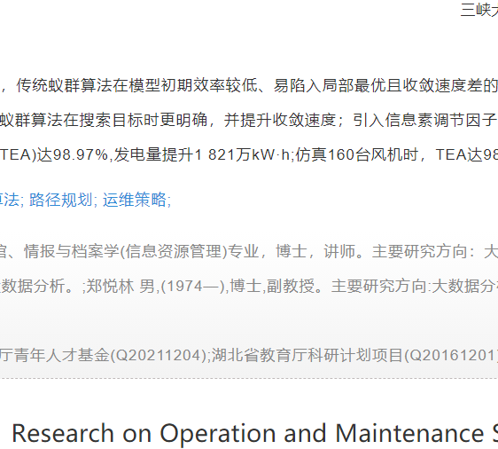

## 一、学习基本指令

  

1. ls [-a, -l, -h] [路径]
2. pwd 显示当前工作目录的绝对路径
3. cd 寻找路径，注意..和~
4. mkdir [-p] [路径] 创建目录，-p是为设置多层目录
5. touch [路径] 用来创建文件
6. cat [文件] 用来查看文件
7. more [文件] 支持翻页查看文件
8. cp - r [路径1] [路径2] 用来复制文件/文件夹(- r )， [路径1]表示被复制的文件，[路径2]表示要复制的位置
9. mv [路径1] [路径2] 用来移动文件/文件夹， [路径1]表示被移动的文件/文件夹，[路径2]表示要移动到的位置
10. rm [-r, -f] 参数1...... ，用来删除文件/文件夹（-r ），-f 是强制删除（管理员权限下）
11. grep [-n] 关键字 文件路径， 用来在文件中通过关键字过滤文件行，关键字建议带‘ ’符号
12. 
13. which 查看所使用的一系列命令的程序文件
14. find 起始路径 -name ‘被查找文件名’

通过find命令去搜索指定文件

15. find 起始路径 -size +-[kMG]

16. echo 输出内容 与print的作用一样

17. 重定向符号 >，将左侧命令的结果覆盖写入到右侧指定文件中

>>， 将左侧命令的结果追加写入到符号右侧指定文件中

18. tail [-f num] linux路径 查看文件尾部内容，并可以持续跟踪（-f）

19. vi/vim 编辑器