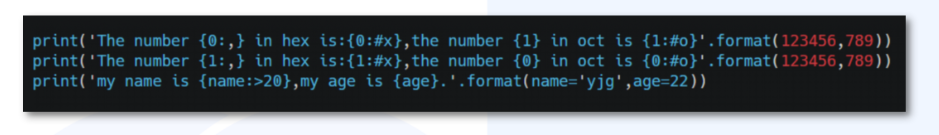

## Python基础篇（扣细节）（未完善，3月11日完成）

1. 创建列表（灵魂，利用推导式，适合竖行输入）

   创建列表一般用一个循环返回，所以直接一行实现是最好的

   例子：`[m for i in range(1,11)]`， 返回一个1~10的列表[1, 2, 3, 4, 5, 6, 7, 8, 9, 10]

   创建列表（适合横向输入）

   `n_list = map(int, input().split())`

   二维列表

   n_list = list(list(map(int, input().split())), for _ in range(n))，建议直接使用list转换格式，不然可能生成不了迭代对象

2. 列表聚合（一般用于计数），使用join方法（以前用过，忽略很多细节）

   例子：`“”.join(m)`，返回12345678910。注意：join方法是用来连接字符的

3. 常用函数（一直更新）

   | 函数                                 | 用法                                                         |
   | ------------------------------------ | ------------------------------------------------------------ |
   | count()                              | 计算                                                         |
   |                                      |                                                              |
   | sorted()                             | 从小到大排序，reverse=False；从大到小排序，reverse=True      |
   | set()                                | 集合，可以用来去重                                           |
   | print(*l)                            | 输出序列中的**内容**，二维数组输出有用，当然可以使用print(xx,end=‘ ’)的方式 |
   | abs()                                | 绝对值                                                       |
   | ord()，chr()                         | 求字母的ASCII码，求ASCII码的字母                             |
   | bin()，oct()，hex()                  | 求数字的二进制，八进制，十六进制                             |
   | format(x, ‘xx.xxf’)，or f’‘{x: .2f}’ | 具体分析                                                     |
   
   
   
   学会分析上面输出的是什么
   
   | 函数(接上表)                  | 用法                                                         |
   | ----------------------------- | ------------------------------------------------------------ |
   | in, not in                    | 成员运算符，简化问题                                         |
   | is，is not                    | 身份运算符                                                   |
   | zip(x,y)                      | 将x和y的同下标内容转换为元组(x[0], y[0])...... 使用方法：[[x,y] for x, y in zip(x,y) ]。用来比较两个东西的迭代方法 |
   | cycle()                       | 循环遍历，`from itertools import cycle`                      |
   | random(), random.randint(x,y) | 生成[0,1]之间的数；生成整数(左闭右开，跟range一样)           |
   | eval()                        | 函数用来执行一个字符串表达式，并返回表达式的值。             |
   | next()                        | 迭代器的专用函数，没有循环                                   |
   
4. 字符串常用函数

   | 函数                                      | 用法                                                         |
   | ----------------------------------------- | ------------------------------------------------------------ |
   | str.split(i)                              | 默认空格分隔，否则按i分隔，只要检测到有i就将其分隔并赋予一个逗号，最后生成一个列表 |
   | str.lower(), str.upper()                  | 将所有字符变成小写，将所有字符变成大写                       |
   | str.capitalize()                          | 将首字母变成大写                                             |
   | str.title()                               | 将每个单词的开头变成大写                                     |
   | str.swapcase()                            | 将每个单词除开头外的字母变大写                               |
   | str.strip(i), str.rstrip(i),str.lstrip(i) | 用于移除字符串指定的字符，r指右边，l指左边                   |
   |                                           |                                                              |

   