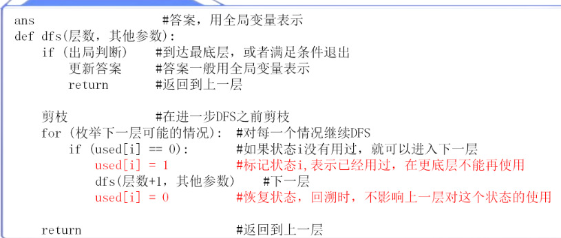
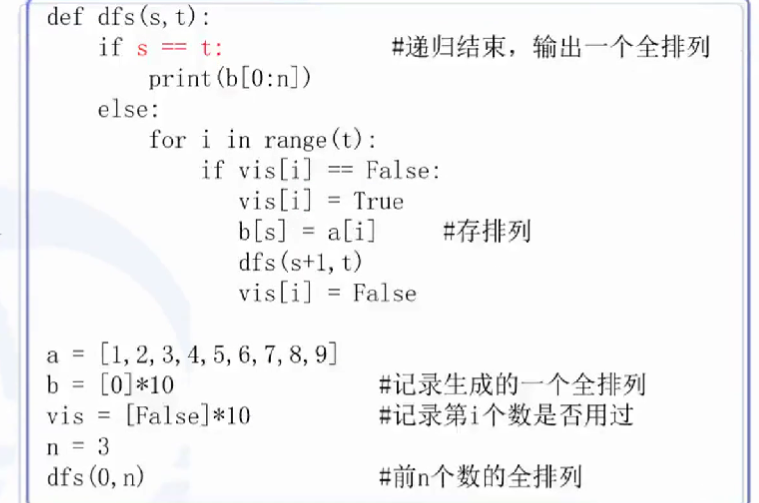
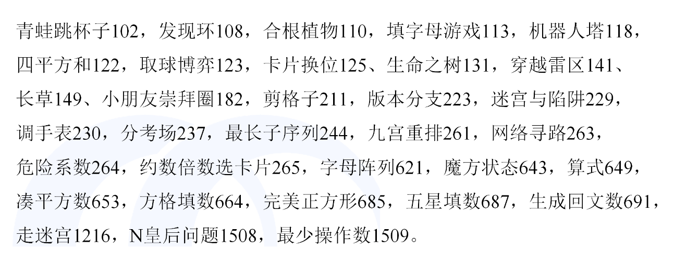

## DFS

**突击搜索算法，为后天笔试做准备。**

1. 在复杂的数据结构上应用，一般是“树”和“图”

2. DFS是深度优先搜索，俗一点讲就是一条路走到黑，走到没路了返回，然后换一条路继续行走，直到看到曙光

3. 设置递归深度`sys.setrecursionlimit(n)`

4. 记忆化存储，递归过程某个数已经存储下来，不需要继续递归最小值，使用数组类型的方法存储。

5. DFS框架（自顶向下的过程）

   

6. 自写排列算法

   

7. 初始化空二维矩阵

   `vis = [[0]*10 for _  in range(10)]`

   不能使用 `vis = [[0]*10]*10`，会导致遍历出问题

## DFS题型总结

1. 给出一张图，明显的格子形式，要求上下左右走动，输出所有路径

